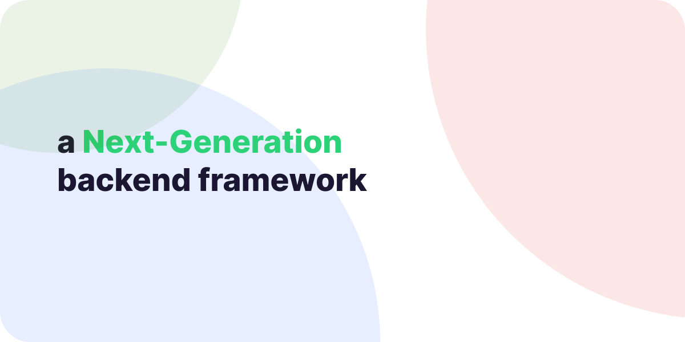

> This repository has been deprecated. Please visit [/zelyjs/core](https://github.com/zelyjs/zely)

# Zely

a Next-Generation backend framework for nodejs

[**github**](https://github.com/do4ng/zely) • [**npm**](https://npmjs.com/package/zely) • [**website**](https://prext.netlify.app/)

---

## Documentation

Visit [zely website](https://zely.netlify.app/).

See the [Getting Started](https://zely.netlify.app/guide/getting-started) to start your first app.

## Contribution

Read [Contributing Guide](https://zely.netlify.app/guide/contributing).

## License

MIT
