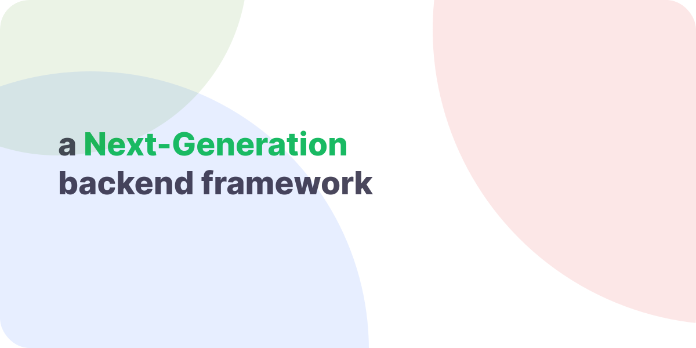

# Prext

a Next-Generation backend framework for nodejs

[**github**](https://github.com/do4ng/prext) • [**npm**](https://npmjs.com/package/prext) • [**website**](https://prext.netlify.app/)

---

## Documentation

Visit [prext website](https://prext.netlify.app/).

See the [Getting Started](https://prext.netlify.app/guide/getting-started) to start your first app.

## Contribution

Read [Contributing Guide](https://prext.netlify.app/guide/contributing).

## License

MIT

